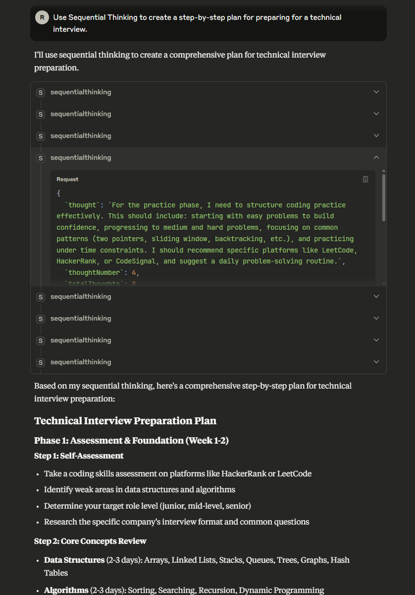

# JaymieXu_homework_week1

## Part 1
### Brave search:

### Github:

### Puppeteer:

### Filesystem:

### Sequential Thinking:

### Notion:

## Part 2
### llama2 Install:

### llama2 with open AI:

The 2020 World Series was played at both Globe Life Field in Arlington, Texas and Estadio de Béisbol La Lancha in Mexico City. However, the LA Dodgers were the home team for Games 1 and 2, which were played at Globe Life Field.

## Part 3
### llama2 with LangChain:

User prompt: 'What is the capital of Germany?'
Model answer: The capital of Germany is Berlin.
